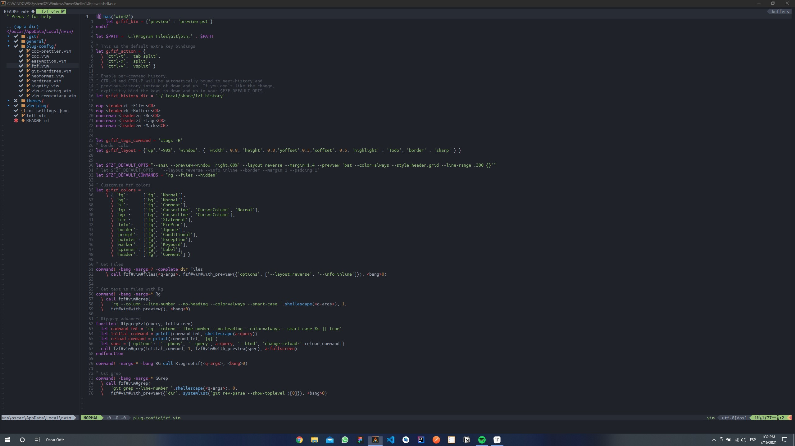

<p align="center">
  <a href="">
    
  </a>

  <h3 align="center">Mi Configuración Para Neovim</h3>

  <p align="center">
    La mejor configuración de Neovim para Windows 10
    <br />
    <br />
    <a href="https://github.com/ZitroCode/neovim-config/tree/master/image">Ver Capturas</a>
    ·
    <a href="https://github.com/ZitroCode/neovim-config/issues">Reportar un Error</a>
    ·
    <a href="https://github.com/ZitroCode/neovim-config/issues">Solicitar Función</a>
  </p>

<details open="open">
  <summary>Tabla de Contenidos</summary>
  <ol>
    <li>
      <a href="#acerca-de">Acerca De</a>
      <ul>
        <li><a href="#deberías-considerar">Deberías Considerar</a></li>
      </ul>
    </li>
    <li>
      <a href="#guía-de-inicio">Guía de Inicio</a>
      <ul>
        <li><a href="#prerrequisitos">Prerrequisitos</a></li>
        <li><a href="#instalación">Instalación</a></li>
      </ul>
    </li>
    <li><a href="#uso">Uso</a></li>
    <li><a href="#contacto">Contacto</a></li>
  </ol>
</details>

## Acerca De



Existen muchas configuraciones para nuestro editor de código **Neovim**, en su gran mayoría para sistemas operativos basados en **Linux** y **MacOS**, Anteriormente utilizaba **Arch Linux** como sistema operativo principal, sin embargo tuve algunos problemas con programas que utilizaba en mi vida cotidiana. Por ese motivo que regrese a utilizar **Windows 10** como sistema operativo. Entre usar diferentes editores de código como **VS Code**, **Atom**, entre otros, no me daban la sensación que me daba neovim. Así que decidí crear mi configuración anterior en **Windows** a pesar de todas las limitaciones que nos trae este sistema operativo.

### Deberías Considerar

En esta configuración yo utilizo fuentes **Nerd Fonts**, **Alacritty** como terminal principal y **Oh My Posh** para cambiar el clásico estilo de PowerShell, Te dejo un enlace para mi configuración de Alacritty en **Windows 10**.

- [Mi Configuración de Alacritty](https://github.com/ZitroCode/alacritty-config)

## Guía de Inicio

Esta es una guía para tener **Neovim** y todos los plugins de mi configuración en tu sistema operativo Windows 10.

Para obtener una copia de mi configuración en funcionamiento, siga estos sencillos pasos.

### Prerrequisitos

Es necesario tener los programas y complementos que se mostraran a continuación

- Node.Js
- NPM
- Git
- Python 2.7
- Python 3.9

### Instalación

**NOTA:** Abre PowerShell como administrador. Ten consideraciónque puedes consultar la guía oficial de Neovim [aquí](https://github.com/neovim/neovim/wiki/Installing-Neovim).

1. Instalar Neovim en nuestro sistema operativo.

   #### [Chocolatey](https://chocolatey.org/)

   - Instalar Neovim:

     ```powershell
     choco install neovim
     ```

   #### [Scoop](https://scoop.sh/)

   - Instalar Neovim:

     ```powershell
     scoop install neovim
     ```

2. Una vez terminado el proceso de instalación crearemos nuestra carpeta de configuración.

```powershell
mkdir ~/AppData/Local/nvim
cd ~/AppData/Local/nvim
```

3. Neovim necesita un archivo llamado `init.vim` para empezar con nuestra configuración. Es hora de clonar este repositorio.

   ```powershell
   git clone https://github.com/ZitroCode/neovim-config.git
   ```

   **Nota:** En este punto si ejecutamos `nvim` tendremos una serie de errores. Sigue estos pasos para corregirlos.

   1. Instalaremos **Vim Plugin Manager**, ya que para mi configuración es necesario.

      ```powershell
      iwr -useb https://raw.githubusercontent.com/junegunn/vim-plug/master/plug.vim |`
          ni "$(@($env:XDG_DATA_HOME, $env:LOCALAPPDATA)[$null -eq $env:XDG_DATA_HOME])/nvim-data/site/autoload/plug.vim" -Force
      ```

   2. Mi configuración utiliza un plugin llamado [FZF](https://github.com/junegunn/fzf) (Command-Line Fuzzy Finder).

      Procedemos a instalarlo.

      #### [Chocolatey](https://chocolatey.org/)

      ```powershell
      choco install fzf
      ```

      #### [Scoop](https://scoop.sh/)

      ```powershell
      scoop install fzf
      ```

      Dentro de la carpeta `plug-config` está un archivo llamado `fzf.vim` el cual contiene la configuración por defecto.

   3. Procedemos a instalar todos los plugins.

      - Abre neovim con el comando `nvim`.
      - Dentro de neovim teclea `:PlugInstall` para empezar a instalar todos los plugins.
      - Para salir lo haces con `:q`.

   **NOTA:** Dentro de `plug-config` estan todas las configuraciones de los plugins, esto te ayudará a omitir varios errores que se puedan presentar.

   Si aún presentas errores con esta configuración puedes reportarlo aquí. Estaré dando soporte continuamente y actualizando esta configuración.

## Uso

Atajos principales

| Descripción de funcionalidades                       | Atajos de teclado |
| ---------------------------------------------------- | ----------------- |
| [Modo Normal] - Guardar cambios en el archivo        | Espacio + w       |
| [Modo Normal] - Guarda y salir del archivo           | Espacio + q       |
| [Modo Normal] - Salir sin guardar o forzar la salida | qq                |

Navegar entre buffers (ventanas).

| Descripción de funcionalidades          | Atajos de teclado |
| --------------------------------------- | ----------------- |
| [Modo Normal] - Cerrar el buffer actual | CTRL + b          |
| [Modo Normal] - Ir al buffer siguiente  | TAB               |
| [Modo Normal] - Ir al buffer anterior   | SHIFT + TAB       |

Navegación entre ventanas

| Descripción de funcionalidades            | Atajos de teclado |
| ----------------------------------------- | ----------------- |
| [Modo Normal] - Ir a la ventana izquierda | CTRL + h          |
| [Modo Normal] - Ir a la ventana derecha   | CTRL + i          |
| [Modo Normal] - Ir a la ventana superior  | CTRL + j          |
| [Modo Normal] - Ir a la ventana inferior  | CTRL + k          |

Cambiar el tamaño de ventanas.

| Descripción de funcionalidades                    | Atajo de teclado |
| ------------------------------------------------- | ---------------- |
| [Modo Normal] - Aumenta el ancho de la ventana.   | ALT + k          |
| [Modo Normal] - Disminuye el ancho de la ventana. | ALT + j          |
| [Modo Normal] - Aumenta el largo de la ventana.   | ALT + h          |
| [Modo Normal] - Disminuye el largo de la ventana. | ALT + l          |

Atajos de Plugins

| Descripción de funcionalidades       | Atajo de teclado |
| ------------------------------------ | ---------------- |
| [Modo Normal] - Prettier             | Espacio + f      |
| [Modo Visual] - Prettier             | Espacio + f      |
| [Modo Normal] - Easymotion           | Espacio + s      |
| [Modo Normal] - FZF abrir (:Files)   | Espacio + f      |
| [Modo Normal] - FZF abrir (:Buffers) | Espacio + b      |
| [Modo Normal] - FZF abrir (:Rg)      | Espacio + g      |
| [Modo Normal] - FZF abrir (:Tags)    | Espacio + t      |
| [Modo Normal] - FZF abrir (:Marks)   | Espacio + m      |
| [Modo Normal] - Abrir NERDTree       | Espacio + n      |
| [Modo Normal] - Comentar línea       | Espacio + /      |
| [Modo Visual] - Comentar líneas      | Espacio + /      |

## Contacto

Oscar Ortiz - [@zitrocode](https://www.instagram.com/zitrocode/) - dev.oscarortiz@gmail.com

Enlace del Proyecto: https://github.com/ZitroCode/neovim-config
